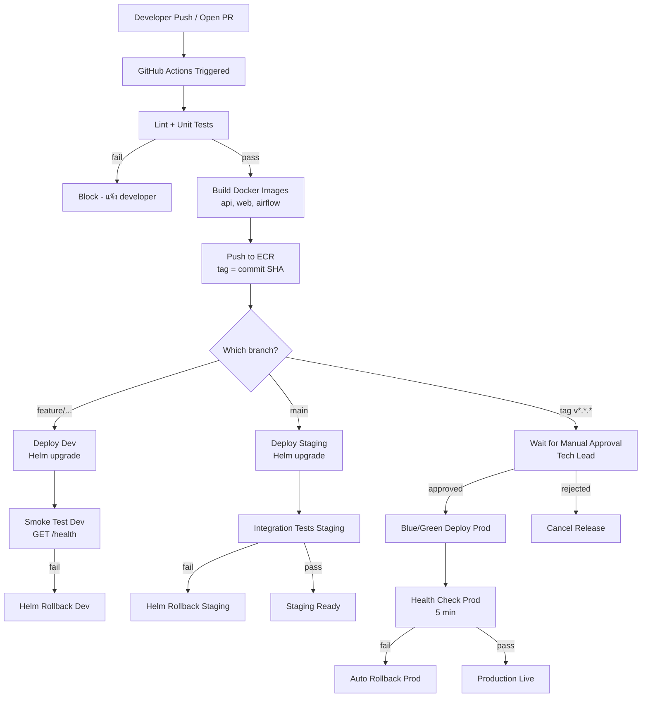

# Architecture & CI/CD Pipeline Design
## Internal Web Application — Multi-Service System

ออกแบบ architecture และ CI/CD pipeline สำหรับระบบ web application ภายในองค์กร ที่เชื่อมต่อกับแหล่งข้อมูลหลายประเภทและแสดงผลผ่านหน้าเว็บ รองรับ environment dev / staging / prod และเชื่อมต่อกับระบบภายนอกได้

---

## 1. ภาพรวม Architecture

ระบบแบ่งออกเป็น 3 ส่วนหลัก ทำงานร่วมกันบน Kubernetes (EKS):

```mermaid
graph TB
    subgraph Users
        U[Browser / Internal Users]
    end

    subgraph AWS Cloud
        subgraph Public Layer
            CF[CloudFront\nCDN + Static Assets]
            ALB[Application Load Balancer]
        end

        subgraph EKS Cluster - Private
            WEB[Web Frontend\nNext.js]
            API[API Service\nFastAPI]
            subgraph Airflow
                SCH[Scheduler]
                WKR[Workers\nCeleryExecutor]
            end
        end

        subgraph Data Layer - Private Subnet
            RDS[(RDS PostgreSQL)]
            REDIS[(ElastiCache Redis)]
            S3[(S3\nDAGs / Files)]
        end

        subgraph Observability
            CW[CloudWatch Logs]
            GRAF[Prometheus + Grafana]
            SNS[SNS - Slack / PagerDuty]
        end

        ECR[ECR\nContainer Registry]
        SM[Secrets Manager]
    end

    subgraph External
        EXTDB[(On-premise DB\nvia VPN)]
        EXTAPI[3rd Party APIs\nvia NAT Gateway]
    end

    U --> CF --> ALB --> WEB
    U --> ALB --> API
    API --> RDS
    API --> REDIS
    API --> SM
    API --> EXTAPI
    SCH --> WKR --> RDS
    WKR --> EXTDB
    WKR --> S3
    WKR --> SM
    EKS Cluster - Private --> CW
    EKS Cluster - Private --> GRAF
    GRAF --> SNS
    ECR --> EKS Cluster - Private
```

### Components

| Service | หน้าที่ | Technology |
|---------|---------|------------|
| Web Frontend | UI สำหรับ user | Next.js, deploy บน EKS |
| API Service | Business logic, REST API | FastAPI (Python) |
| Airflow Scheduler | จัดคิวและ trigger DAGs | Apache Airflow |
| Airflow Workers | รัน workflow tasks จริง | CeleryExecutor + Redis |
| RDS PostgreSQL | Primary database | AWS RDS, private subnet |
| ElastiCache Redis | Cache + Celery message broker | AWS ElastiCache |
| ECR | เก็บ Docker images | AWS Elastic Container Registry |
| Secrets Manager | เก็บ credentials ทุกตัว | AWS Secrets Manager |

---

## 2. Environment Strategy

แยก 3 environment โดยใช้คนละ AWS account เพื่อ isolate อย่างสมบูรณ์ ป้องกัน blast radius และแยก billing ได้

```
┌─────────────┐    merge PR     ┌──────────────┐    release tag    ┌──────────────┐
│     Dev     │ ──────────────▶ │   Staging    │ ────────────────▶ │     Prod     │
│ AWS Account │                 │ AWS Account  │                   │ AWS Account  │
└─────────────┘                 └──────────────┘                   └──────────────┘
  auto deploy                     auto deploy                       manual approval
  feature branch                  main branch                       tag v*.*.*
```

### Infrastructure per Environment

| ส่วน | Dev | Staging | Prod |
|------|-----|---------|------|
| EKS Nodes | t3.medium × 2 | t3.large × 2 | m5.xlarge × 3 + autoscaling |
| RDS | db.t3.micro | db.t3.small | db.r6g.large, Multi-AZ |
| API Replicas | 1 | 2 | 3 + HPA |
| Airflow Workers | 1 | 2 | 3 + autoscaling |
| Redis | cache.t3.micro | cache.t3.small | cache.m6g.large, Multi-AZ |
| Backup | ไม่มี | 1 วัน | 7 วัน |
| Monitoring | Basic | Standard | Full + Alerting |

### Infrastructure as Code

- ใช้ **Terraform** จัดการ infrastructure ทุก environment แยก state ต่าง account ผ่าน S3 backend
- Deploy application ผ่าน **Helm** แยก `values` ต่อ environment

```
terraform/
├── modules/          # shared modules (vpc, eks, rds, redis)
└── environments/
    ├── dev/
    ├── staging/
    └── prod/

helm/
├── api/
│   ├── values.yaml
│   ├── values.dev.yaml
│   ├── values.staging.yaml
│   └── values.prod.yaml
├── web/
└── airflow/
```

---

## 3. CI/CD Pipeline

### Flow



### Image Tagging

```
feature/xxx  → <service>:dev-<sha7>
main         → <service>:staging-<sha7>  และ  <service>:latest
v1.2.3       → <service>:1.2.3  และ  <service>:stable
```

### GitHub Actions

ดูได้ที่ [.github/workflows/ci-cd.yml](.github/workflows/ci-cd.yml)

| Job | Trigger | หน้าที่ |
|-----|---------|---------|
| `test` | ทุก push / PR | lint, unit test |
| `build` | หลัง test ผ่าน | build + push image ไป ECR |
| `deploy-dev` | feature branch | helm upgrade dev namespace |
| `deploy-staging` | main branch | helm upgrade staging namespace |
| `deploy-prod` | tag `v*.*.*` | manual approval → helm upgrade prod |

---

## 4. Configuration & Secrets Management

### Secrets

ทุก secret เก็บใน **AWS Secrets Manager** แยก path ตาม environment ไม่มีอะไร hardcode ใน code หรือ Docker image

```
/dev/api/db
/dev/airflow/fernet-key
/staging/api/db
/staging/external/api-keys
/prod/api/db
/prod/airflow/fernet-key
/prod/external/api-keys
```

EKS pods ดึง secret ผ่าน **IRSA (IAM Roles for Service Accounts)** — pod แต่ละตัวมี IAM role ของตัวเอง อ่านได้เฉพาะ secret ที่จำเป็น ไม่มี plaintext ใน environment variable

### Non-sensitive Config

เก็บใน Helm `values` files ต่อ environment เช่น replica count, resource limits, feature flags

### การเชื่อมต่อระบบภายนอก

| ปลายทาง | วิธีเชื่อมต่อ | เหตุผล |
|---------|--------------|--------|
| On-premise DB | AWS Site-to-Site VPN | encrypted tunnel, ไม่ผ่าน internet |
| Cloud service อื่น | VPC Peering / PrivateLink | traffic ไม่ออก internet |
| 3rd Party API | NAT Gateway + IP whitelist | ออกผ่าน fixed IP เดียว |

---

## 5. Reliability & Observability

### Health Checks

```yaml
livenessProbe:
  httpGet:
    path: /healthz
    port: 8000
  initialDelaySeconds: 30
  periodSeconds: 10

readinessProbe:
  httpGet:
    path: /ready
    port: 8000
  initialDelaySeconds: 10
  periodSeconds: 5
```

- **Liveness**: container ค้าง → Kubernetes restart อัตโนมัติ
- **Readiness**: pod ยังไม่พร้อม → ALB ไม่ส่ง traffic มา
- **ALB Health Check**: ตรวจทุก 30s ถ้า fail 3 ครั้งติด → ออกจาก target group

### Monitoring

- **Prometheus** scrape metrics จากทุก pod ผ่าน `/metrics`
- **Grafana** dashboards: API latency, error rate, pod resource, Airflow DAG success rate
- **CloudWatch Container Insights** สำหรับ EKS node-level metrics

### Logging

- Fluent Bit DaemonSet รวบรวม log จากทุก pod ส่ง → **CloudWatch Logs**
- แยก log group ต่อ service และ environment: `/app/prod/api`, `/app/prod/worker`
- Retention: dev 7 วัน → staging 30 วัน → prod 90 วัน

### Alerting

CloudWatch Alarms → SNS → Slack / PagerDuty

| Alert | เงื่อนไข | ระดับ |
|-------|---------|-------|
| API Error Rate สูง | 5xx > 1% นาน 5 นาที | Critical → PagerDuty |
| API Latency สูง | p99 > 2s นาน 5 นาที | Warning → Slack |
| Pod CrashLoopBackOff | restart > 3 ครั้งใน 10 นาที | Critical → PagerDuty |
| RDS FreeStorage ต่ำ | < 10 GB | Warning → Slack |
| Airflow DAG Failed | task fail | Warning → Slack |

---

## 6. Promotion & Release Strategy

```
feature/xxx
    │  code review + PR approval
    ▼
  main ──────────────────────────────▶ staging (auto deploy + integration tests)
    │                                       │
    │  สร้าง release tag (v1.2.3)           │  tests ผ่าน
    ▼                                       ▼
  tag v1.2.3 ──▶ manual approval ──▶ prod (blue/green, auto rollback ถ้า fail)
```

### Rollback

| ระดับ | วิธี | เวลา |
|-------|------|------|
| Application | `helm rollback <release> <revision>` | < 2 นาที |
| Infrastructure | Terraform apply จาก state ก่อนหน้า | 10–20 นาที |
| Database | Migration down script / restore RDS snapshot | 15–60 นาที |

ทุก DB migration ต้องมี `downgrade` script คู่กันเสมอ และต้องผ่าน review ก่อน merge

---

## Assumptions

- ใช้ AWS เป็น cloud provider หลัก
- Container orchestration ใช้ EKS เพราะรองรับ Airflow + autoscaling ได้ดีกว่า ECS
- CI/CD ใช้ GitHub Actions เพราะ integrate กับ repository ได้ตรง ไม่ต้องมี CI server เพิ่ม
- Airflow ใช้ CeleryExecutor + Redis เพราะรองรับ parallel tasks และ scale worker ได้อิสระ
- แยก AWS account ต่อ environment เพื่อ isolate permission และ billing อย่างสมบูรณ์
- Blue/Green สำหรับ prod เพราะ zero-downtime และ rollback ทันทีได้โดยไม่ต้อง redeploy
