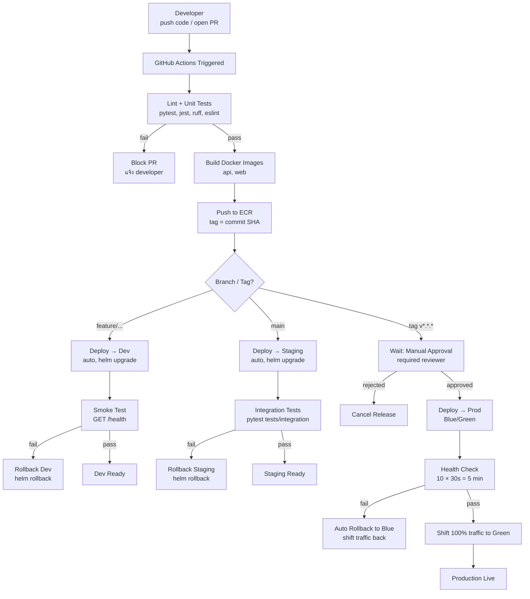

# CI/CD Pipeline Flow

---

## Pipeline Overview



---

## Branch Strategy

```
main ──────────────────────────────────────────────── production-ready
  │
  ├── feature/add-dashboard  ──▶ dev
  ├── feature/fix-api-auth   ──▶ dev
  └── (merge PR)             ──▶ staging
                                    │
                              tag v1.2.3
                                    │
                                   prod (manual approval)
```

## Image Tagging

| Trigger | Image Tag | ตัวอย่าง |
|---------|-----------|---------|
| feature branch push | `dev-<sha7>` | `api:dev-a1b2c3d` |
| main branch push | `staging-<sha7>` | `api:staging-e4f5g6h` |
| release tag | `<version>` | `api:1.2.3` |

---

## Blue/Green Deployment (Production)

```
Before deploy:
  ALB → Blue (current v1.1.0) 100%

Step 1 — Deploy Green:
  ALB → Blue (v1.1.0) 100%
         Green (v1.2.0) — not receiving traffic yet

Step 2 — Health Check (5 min):
  ถ้า Green healthy → ไปต่อ
  ถ้า Green unhealthy → ลบ Green, คงไว้ Blue

Step 3 — Shift Traffic:
  ALB → Blue (v1.1.0) 0%
         Green (v1.2.0) 100%

Step 4 (next release) — Blue becomes old Green:
  ลบ Blue หลังจาก stable 24h
```

---

## Secrets ที่ใช้ใน Pipeline

| Secret | ใช้ใน Job | เหตุผล |
|--------|----------|--------|
| `DEV_AWS_ACCESS_KEY_ID` | deploy-dev | access dev AWS account |
| `STG_AWS_ACCESS_KEY_ID` | deploy-staging | access staging AWS account |
| `PROD_AWS_ACCESS_KEY_ID` | deploy-prod | access prod AWS account |
| `AWS_ACCOUNT_ID` | build | ECR registry URL |
| `PROD_ALB_RULE_ARN` | deploy-prod | shift ALB traffic |
| `PROD_TG_BLUE_ARN` | deploy-prod | blue target group |
| `PROD_TG_GREEN_ARN` | deploy-prod | green target group |

ทุก secret เก็บใน **GitHub Environment Secrets** แยกต่อ environment (`dev`, `staging`, `production`)

---

## ดูไฟล์ workflow จริง

[.github/workflows/ci-cd.yml](.github/workflows/ci-cd.yml)
